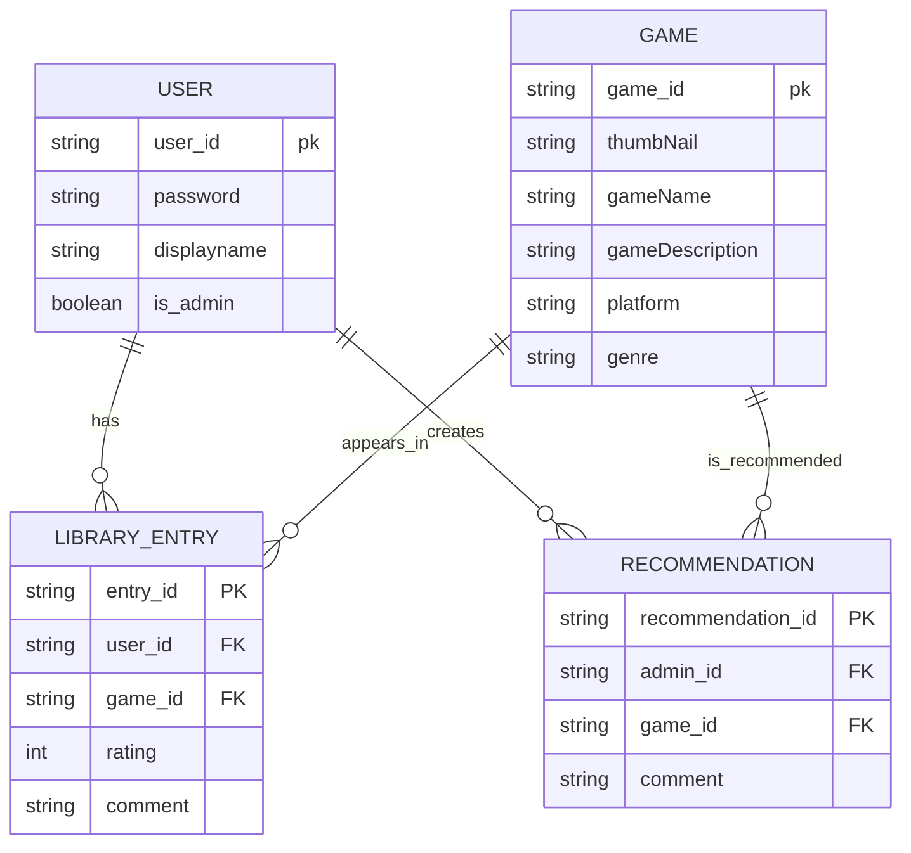

# FavGame Proposal

## 1. The pitch (one paragraph)
What the API does, who uses it, and why a client app would need it.  
The API holds user information. The API also holds video game information. This app was made for users who wish to organize and sort video games. This app was made for gamers who play a lot of video games.

## 2. Resources
| Resource | Key fields | Relationships |  
|---|---|---|  
| User | id, password, displayName, isAdmin | A User has many Game entries |  
| Game | id, thumbnail, gameName, description, genre, platform | A Game can appear in many library entries |  
| LibraryEntry | id, userId, gameId, rating, comment | A Library Entry belongs to one User and one Game |  
| Recommendation | id, adminId, gameId, comment | An Admin can create many Recommendations for Games | 

## 3. ER sketch
Tables, primary and foreign keys, and cardinality. Edit this Mermaid diagram (it renders on GitHub;  
try changes at [https://mermaid.live](https://mermaid.live)):

## 4. Endpoints
| Verb | Path | Auth | Purpose |  
|---|---|---|---|  
| POST | /favGame/v1/auth/register | public | creates new user |  
| POST | /favGame/v1/auth/login | public | authenticate user |  
| GET | /favGame/v1/users/ | user | retrieve own profile info |  
| PATCH | /favGame/v1/users/password | user | update own password |  
| PATCH | /favGame/v1/users/icon | user | update own user icon |  
| DELETE | /favGame/v1/users/ | user | delete own account and all data |  
| GET | /favGame/v1/users/games?page=0&size=10 | user | list games in user's library (paginated) |  
| GET | /favGame/v1/users/games?sort=alphabetical | user | sort user's games alphabetically |  
| GET | /favGame/v1/users/games?sort=columnName | user | sort user's games by column |  
| GET | /favGame/v1/users/games?genre={genreType} | user | filter user's games by genre |  
| GET | /favGame/v1/users/games/search?query={gameName} | user | search user's games |  
| GET | /favGame/v1/users/games/{id} | user | view a single game in user's library |  
| POST | /favGame/v1/users/games | user | add a game to user's library |  
| PATCH | /favGame/v1/users/games/{id} | user | update rating or comment for a game |  
| DELETE | /favGame/v1/users/games/{id} | user | remove a game from user's library |  
| POST | /favGame/v1/users/games/{id}/comments | user | add a comment to a game |  
| GET | /favGame/v1/games | user | list available games |  
| GET | /favGame/v1/games/{id} | user | view game information |  
| GET | /favGame/v1/recommendations | user | view admin game recommendations |  
| GET | /favGame/v1/users | admin | list all users |  
| GET | /favGame/v1/users/{userId} | admin | view one user |  
| PATCH | /favGame/v1/users/{userId} | admin | update a user, including granting or revoking admin |  
| DELETE | /favGame/v1/users/{userId} | admin | delete a user and all their data |  
| POST | /favGame/v1/recommendations | admin | create a game recommendation |  
| DELETE | /favGame/v1/recommendations/{id} | admin | delete a recommendation |  
| ... | ... | ... | ... |  
Mark each endpoint `public`, `user`, or `admin`. Mark which collection paginates and which  
filters or sorts.

## 5. Technical choices
- **Database host:** (Neon, Supabase, Railway, Atlas, ...) and why  
  Supabase- Someone on our team has experience with this database host.
- **OAuth2 provider:** (Google, GitHub, Auth0) and confirmation that it supports Authorization Code + PKCE from a native app  
  GitHub- Yes, we confirmed that GitHub does support Authorization Code + PKCE from a native app.
- **Repo layout:** monorepo or split, and why  
  Split- it seemed easier to organize and sync the Gradle.   
  These become your ADRs later.

## 6. Risks
The two things most likely to go wrong, and what you will do first to find out.  
The front-end repo and back-end repo failing to connect. We can confirm this by running a placeholder UI with bare-bones back-end code.  
Login/auth is breaking the connection between the app and the API. Test the login function to see if it crashes or does not work.

## 7. Team and Sprint 1
Who owns what in Sprint 1. Link your Project board and Sprint 1 milestone.  
Owner: Jessika Torrealba jesscococ09  
Project Board:  
[https://github.com/users/jesscococ09/projects/2](https://github.com/users/jesscococ09/projects/2)   
Sprint 1:  
[https://github.com/jesscococ09/favGameFrontend/milestone/1](https://github.com/jesscococ09/favGameFrontend/milestone/1) 